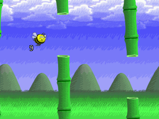

# hocoslamfy, running with Rumble and more

You are a small bee and you must fly to avoid the bamboo shoots!

This game requires SDL 1.2, SDL-image 1.2, SDL-mixer 1.2 and a C compiler. It is optimised for low-resolution screens.

Everything's under the GPL version 2.

To compile this for PC, use `make clean; make` on a PC with SDL, SDL-image and SDL-mixer 1.2. You'll then get a windowed SDL game.

To compile this for MiyooCFW change PATH env variable to eg.: `PATH=$PATH:/opt/miyoo/bin` and use `make TARGET=hocoslamfy-miyoo`. Program uses `./data` dir for storing necessary assets including *.ogg audio. To enable RUMBLE remove -DNO_SHAKE flag and add `libshake` to your custom toolchain.

To compile this for OpenDingux on Dingoo A320 or GCW Zero, use `make TARGET=hocoslamfy-gcw0 clean; make TARGET=hocoslamfy-gcw0 opk` on a PC with the `PATH` set to include your OpenDingux mipsel toolchain. To compile for OpenDingux on RS-90, substitute `TARGET=hocoslamfy-rs90`.

To compile / develop using Visual Studio Code, you can now also simply use a DevContainer with a gcw0 enabled buildroot and RetroFW toolchain on Windows with Docker.

# Fork details
This fork is being based on the most recent (feature wise) version I have found [here](https://github.com/fgl82/hocoslamfy) provided by [fgl82](https://github.com/fgl82).

It does also include all the good CI/CD stuff from [Arcnor](https://github.com/Arcnor) which you can find [here](https://github.com/Arcnor/hocoslamfy).

Special thanks also to [OpenDingux](https://github.com/OpenDingux) for providing the generic [buildroot](https://github.com/OpenDingux/buildroot) as well as again to [Arcnor](https://github.com/Arcnor) for providing (as well as [hosting!](https://ghcr.io/arcnor/toolchain-opendingux/gcw0)) the [toolchain image](https://github.com/Arcnor/OpenDingux-Buildroot).

# Latest features
- Can enable/disable Rumble (by pressing L1)
- Can attach/detach score to/from Bee (by pressing R1)
- By pressing R2 on the RG280V you can now create screenshots
- Bugfixes so the game doesn't crash randomly

# Screenshots
## Title screen
 
## In game
 
## Gameover
